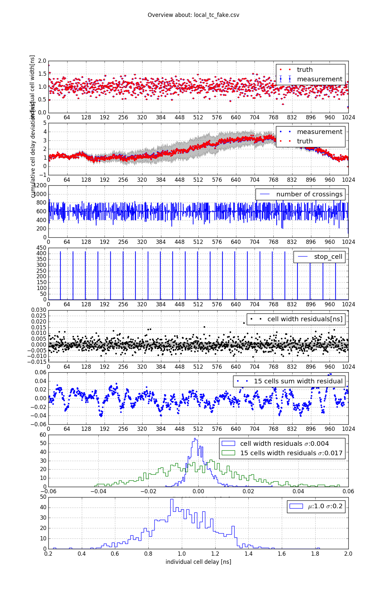
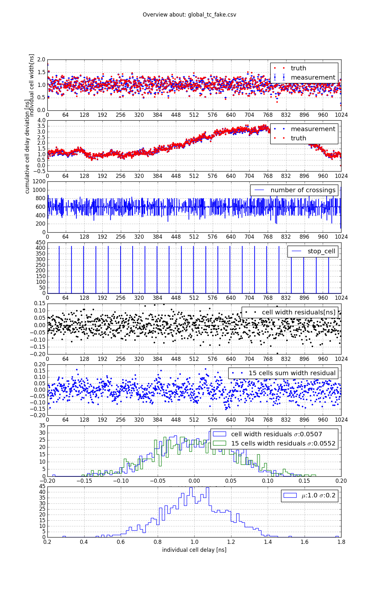

# Charge Resolution and Arrival Time Resolution on the Dragon board with respect to DRS4 inhomogeneous sampling.

D. Neise 05.07.2016

## Abstract

On slide 22 "Application to pulse measurement" of [1] was shown, the extracted charge of test pulses, shows a relatively wide distribution of ~6%, which can be reduced to 2%, when DRS4 time calibration is applied. One possible implementation is shown on slide 18 of [1]. 

In this document we want to study the spread of the extracted charge caused by the inhomogeneous sampling of the DRS4 as well as evaluate methods to mitigate this effect in order to improve charge extraction. 
In addition we want to study the effect of inhomogeneous sampling on arrival time resolution as well as methods to improve it.

## Input files for this study

This study is based on 5 files, which have been selected by Taka 
specifically for this study and uploaded on 26.05.2016 onto `lynx01.physik.tu-dortmund.de`. 

The files can be found in 
`dragonboard@lynx01.physik.tu-dortmund.de:~/storage/DataFromTaka`

The filenames are:

 1. README
 1. Ped300Hz.dat
 1. LnG40.dat
 1. Ped300Hz_forSine.dat
 1. SinWithHighOffset2.dat

As explained in the `README` file, the two text files named `Ped*.dat` contain the offsets, which can be subtracted from the raw data. 
The file `SinWithHighOffset2.dat` contains a 300MHz sine wave, which can be used for time calibration and the file `LnG40.dat` contains test pulses, which can be used to learn something about the charge resolution and how it is affected by the inhomogeneous sampling of DRS4. 
Also the arrival time resolution may be studied using the test pulses.


## Results to be crosschecked.

The results to be crosschecked can be found in 
[DRS4 Timing Constant Calibration needed?](https://www.cta-observatory.org/indico/getFile.py/access?contribId=1&resId=1&materialId=slides&confId=1128)[1]

The code, these results were created with is unknown to the author of this crosscheck. 
It is not known, whether the data, this crosscheck is based on, is identical to the data the results above are based on.


## What is DRS4 time calibration?

The term "DRS4 time calibration" typically involves two parts:

 1. Measurement of individual sample delays $d_i$ for all cells of a DRS4 chip.
 2. Application of the $d_i$ to mitigate the effects of inhomogeneous sampling.

In order to measure the $d_i$ typically a known periodic signal is sampled, which can be used to infer the individual sample delays. 
Several methods exist. For this crosscheck two methods shown in e.g. 
[Novel Calibration Method for Switched Capacitor Arrays Enables Time Measurements With Sub-Picosecond Resolution](http://arxiv.org/pdf/1405.4975v3.pdf)[2] 
shall be used:


 1. Local time calibration, based on the slope of the calibration signal close to a zero crossing.
 2. Global time calibration, based on the number of cells between two (or more) zero crossings.

### Local Time calibration

When taking samples of a voltage with constant slope at two different instances of time, 
one can infer the time between samples $d_i$ simply as 
$d_i = \frac{\Delta v_i}{\overline{\Delta v}} \cdot \tilde{d}.$ where
$\Delta v_i = v_{i+1} - v_i$ is the difference in voltage measured at points $i$ and $i+1$, 
$\overline{\Delta v}$ is the average of all $\Delta v_i$ for all 1024 cells and
$\tilde{d}$ is the nominal delay between the samples, e.g. 1 ns when sampling at 1GHz.

When using a sinusoidal calibration signal with adequately long periods one may aproximate the voltage near the zero crossing with a linear function. Thus samples near the zero crossing may be used for this method. 

A possible implementation of this method can be found in `calc_local_tc.py`.

### Global Time Calibration

When sampling a known periodic signal with period $p$, the cell width $d_i$ can be inferred, 
when comparing the measured period to the known one. 
The implementation of the global time calibration used for this study was inspired by Stefan Ritt in [2].
It involves finding a period of the signal in the sampled waveform. 
The beginning and end of a period is found by simple linear interpolation 
to find the zero crossing points. By using start values for the 
individual $d_i$, e.g. the trivial hypothesis that $d_i = \tilde{d} \forall i$, one can calculate the 
measured length $p_k$ of the k-th period found in a sampled waveform as:

$p_k = \sum_{i=0}^{M} d_i \cdot w_i$ 

where the $w_i$ denote the fraction of a cell lying inside the period $k$ in question.
Consequently a new iteration of $d'_i = d_i \cdot n_i$ is formed in such a way, 
that:

$p'_k = \sum_{i=0}^{M} d'_i \cdot w_i = p$

The $n_i$ in our implementation are defined as:

$n_i = n_{+} \cdot w_i + n_{-} \cdot (1-w_i)$

where:

$n_{+} = \frac{p}{p_k}$ and $n_{-} = \frac{T - p}{T - p_k}$

This definition of $n_i$ ensures that always $\sum d_i = T$, which sounded reasonable to us.
However the original proposal one can find in [2] does not include this "feature", instead it leaves the $\sum d_i$ a free parameter,
thus one is even able to measure the domino period $T$ with this method using the known period of the calibration signal.

Our first implementations of this method however, did diverge and resulted in unphysical values after the final iteration. 
So we though it is reasonable to make use of the same assumptions as in the Local TC, in order to achieve a decent result. 

The original proposal of Stefan Ritt also mentions that the global TC needs not to be based on one period intervals, 
but generally N period intervals can be used to learn about cell widths. This implementation however only uses N=1.

Our implementation can be found in 'calc_global_tc.py'.


### DRS4 Offset calibration

In order to use DRS4 sampled data, one should apply some form of amplitude calibration. The DRS4 storage cell output buffers show an 
inhomogeneous offset and gain distribution. In addition time dependent offsets can be observed, 
which depend of the time between consecutive readouts of a storage cell.

The [dragonboard_testbench](https://github.com/cta-observatory/dragonboard_testbench) software package contains several different methods of 
amplitude calibrations, since dragonboard_testbench was developed to study these. 
The currently best performance is achieved by using 
the method implemented in 'dragonboard.calibration.TimelapseCalibration'. 
In order to apply such a calibration, the calibration constants need to found, by analyzing a dedicated pedestal file.
The analysis of such a pedestal file can be done by calling `calc_timelapse_constants`.

As one can learn from the help:

```
dneise@lair:~$ calc_timelapse_constants --help
Usage:
  calc_timelapse_constants <outputfile> <inputfiles> ... [options]

Options:
  --max_events N    integer; maximum events to be used from a file. default is all.
  --skip_begin N    integer; number of start-samples to be skipped for fitting [default: 5]
  --skip_end N      integer; number of end-samples to be skipped for fitting [default: 5]
  --do_channel8     fit also channel 8 values
```

A typical call might look like: 

`calc_timelapse_constants calib.h5 foo_pedestal.dat bar_pedestal_7.dat ../*ped*.dat`

as it is possible to combine several pedestal files in order to increase statistics or fill the parameters space.

For this study however, no pedestal files were provided. Instead a text file containing some of the calibration constants was provided. 
In order to use this text file for offset calibration 
a dedicated calibrator class has been implemented in `dragonboard.calibration.TakaOffsetCalibration`.

So the typical known loop can be used:

```python
import dragonboard as dr

event_generator = dr.EventGenerator("path/to/datafile.dat")
calib = dr.calibration.TakaOffsetCalibration("path/to/takas_calibration_file.txt")

for event in event_generator:
    calibrated_event = calib(event)
    # do something with the event
```
\newpage$

## Result of Local and Global TC

Before learning about the effect of the individual cell width, 
or sample delays $d_i$ on the extracted charge resolution, 
first the cell widths need to be measured. 
By applying the methods "Local TC" and "Global TC" on the same data, 
we get some form of self crosscheck. 

The user interface should be shown using `calc_local_tc.py` as an example, the CLI for `calc_global_tc.py` is very similar:

```bash
dneise@lair:~/LST/crosscheck_data_from_taka$ ./calc_local_tc.py --help
Usage:
  calc_local_tc.py [options]

Options:
  -i PATH      path to file with sine wave, to be analysed [default: SinWithHighOffset2.dat]
  -c PATH      path to textfile with offsets ala Taka, to be subtracted [default: Ped300Hz_forSine.dat]
  -o PATH      path to outfile for the cell widths [default: local_tc.csv]
  --pixel N    pixel in which the sine wave should be analysed [default: 0]
  --gain NAME  gain type which should be analysed [default: high]
  --fake       use FakeEventGenerator, ignores '-i' and '-c'.
```

Sane default parameters have been chosen, to make calling the programs easy and serve as an implicit kind of documentation. 
As one can see the program simply assumes a file named `SinWithHighOffset2.dat` to exist in the current working directory. 
This makes sense, as the scope of this project is very narrow.
However the user may specify another input file as well. 
The `--pixel` parameter can be used, to perform the analysis based on another pixel, by default pixel 0 is analyzed. 
The `--gain` parameter can be used, if e.g. the low gain branch should be used.
The `--fake` parameter is a very recent addition and will be explained further below.


The result of the analysis is basically the cell width $d_i$. It is stored in a csv file, 
to allow for quick analysis using any analysis framework from matlab to excel. 
If one would like to use Python, the csv file can be read e.g. with pandas using:

```python
import pandas as pd

local_tc = pd.read_csv("path/to/local_tc.csv")
cell_width = local_tc["cell_width_mean"]
cell_width_err = local_tc["cell_width_std"]
```

In order to get a quick view into such a csv file a little plotter is provided which creates a png file. 
It can be used like:

```bash
dneise@lair:~/LST/crosscheck_data_from_taka$ ./plot_tc.py local_tc.csv 
local_tc.csv -> local_tc.png
```

As one can maybe guess from the output, the little plotter does save the PNG from `basename.csv` to `basename.png`. 
An output filename can, at the moment, not be specified.

Here one can see the current results.

{ width=50% }
{ width=50% }

While in the former revision of this crosscheck there were clear similarities between the two results, this is not the case anymore.
The cumulative cell delay deviations from global_tc.csv shown in the 2nd axis from the top, show a sharp peak around cell ~320. 
The position of this peak happens to coincide with the stop cell position of the last event, being analyzed. 

So we do not trust the global TC method at the moment.

## Evaluation by Simulation

In order to understand the problem with the global TC method a small DRS4 simulation has been implemented in `fake_event_gen.py`, 
which can be used as a drop in replacement for the `dragonbaord.EventGenerator` class. Since no DRS4 offset inhomogeneity 
has been implemented no offset calibration is needed. 
So in order to not touch the analysis code, one can use a simple "no op" function as `calib` like this:

```python
from fake_event_gen import FakeEventGenerator
event_generator = FakeEventGenerator(trigger_times=np.arange(10000)* (1/300)) # 10k evts at 300Hz
calib = lambda x: x

# an now the ususal:
for event in event_generator:
    calibrated_event = calib(event)
    # do something with the event
```

Such a `FakeEventGenerator` samples a sine wave with $30 + 10^{-7}$ MHz frequency and 1500 LSB amplitude, 
which is not phase locked with the DRS4 chip, so a random phase is added for every event. 
This delivers very good and reliable results, since it is ensured, that all cells are treated equally.
It is however possible to switch off the random phase and see what impact this has on the analysis.
Also a certain amount of electronics noise is added to the sampled sine wave, white noise with $\sigma=10 LSB$ is the default.

The cell_widths used by the `FakeEventGenerator` can either be random, or be taken from a csv file. This way one can simulate how both methods work under the assumption that one of the methods provided a correct result.

Using `local_tc.csv` as input for the `FakeEventGenerator` the plots look like this

{ width=50% }
{ width=50% }

As one can see, when working on simulated data, both methods perform reasonable a reproduce the simulated cell widths rather well.
The local TC method shows a smaller residual distribution with a $\sigma=4ps$ only, while the global TC shows a $\sigma = 51ps$.
For correctly measuring the arrival time of a pulse, say in the middle of a sampled wave form of 30 samples, 
it is important to know the sum of 15 consecutive cells, rather than the width of each individual cell. 
As an example the residuals for sums over 15 consecutive cells are shown in green. 
For the local TC the residuals of the sum behave as expected and 
increase roughly by a factor $\sqrt{15}$. 
For the global TC obviously the uncertainties are correlated as the residuals of the sum over 15 does not increase at all.

Still the local TC performs much better here, which stands in contrast to [2], where Stefan Ritt proposes to use 
the global TC to refine the results of the local TC. This we take as a strong hint for an 
error in the implementation of the global TC. 

However the results of the evaluation of the local TC method based on simulations shows, 
that this method is able to measure the individual cell widths with an uncertainty of about 4 ps.

## Application to test pulse data.

A small script has been written `extract_pulses.py` which extracts some parameters from a raw-file containing test pulses. Only a single pixel / gain combination can be analysed with this simple script. For further options please refer to the help, e.g.:

    dneise@lair:~/LST/DataFromTaka$ python extract_pulses.py --help
    Usage:
      extract_pulses.py [options]

    Options:
      --input PATH    path to file containing test pulses [default: LnG40.dat]
      --offset PATH   path to textfile with offset ala Taka, to be subtracted [default: Ped300Hz.dat]
      --tc PATH       path to csv containting cell_widths [default: local_tc.csv]
      --channel N     channel number to be analyszed [default: 0]
      --gain NAME     name of gain_type to be analysed. high/low [default: high]
      --maxevents N   number of events to be used [default: all]
      --int_window N  size of integration window [default: 5]

The script produces two plots, named `charge_resolution_{tc_filename}.png` and `time_resolution_{tc_filename}.png`. 

First let us look at the charge resolutions. On the left side we see the result using the local TC. On the right side the results obtained using the global TC are shown. 
As already reported by Taka on slide 18 in [1], the distribution of the integral (using an integration window of 5 samples centered around the maximum) is with 7% too wide. 

In order to mitigate the effects of inhomogeneous sampling the integral was weighted with the individual sampling delays of the involved cells, leading to a smaller width of the distribution, as already reported by Taka. The result of Taka (2%) was not reproduced. Different other methods have been tried, in order to reach the width of 2%. Convoluting the sampled time series with a template of the test pulse delived a nice width, but is computationally expensive. 


{ width=50% }
{ width=50% }

This is the pulse template used for the convolution method shown in light blue.
It can be obtained using `find_pulse_template.py`.

{ width=50% }

It was interesting to see, that the test pulse is a rectangular pulse of ~2.5ns width.

The time resolutions are not particularly interesting as the arrival time distribution using only a single channel is expected to be largely unaffected of the inhomogeneous sampling.

{ width=50% }
{ width=50% }

