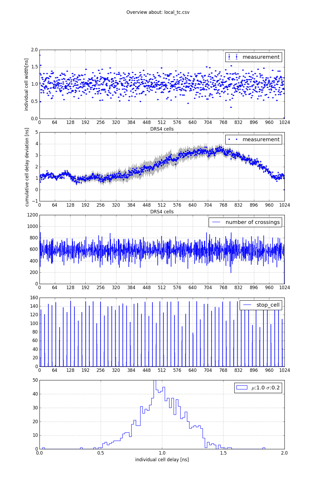
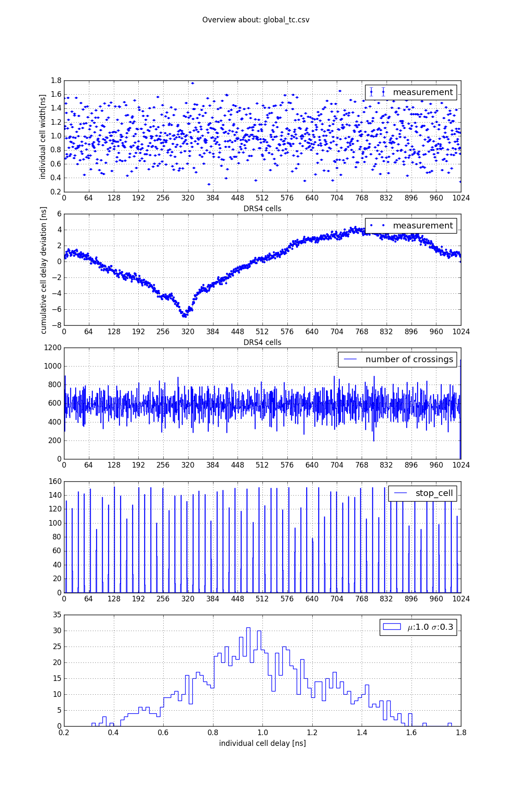

# Crosscheck dragonboard DRS4 Timecalibration

D. Neise 27.06.2016

In this document I summarize the current status of my crosschecks 
for the DRS4 time calibration on the dragon board. 
This study is based on 5 files, which have been selected by Taka 
specifically for this study and uploaded on 26.05.2016 onto `lynx01.physik.tu-dortmund.de`. 

The files can be found in 
`dragonboard@lynx01.physik.tu-dortmund.de:~/storage/DataFromTaka`

The filenames are:

 1. README
 1. Ped300Hz.dat
 1. LnG40.dat
 1. Ped300Hz_forSine.dat
 1. SinWithHighOffset2.dat

As explained inside the `README` file, the two files named `Ped*.dat` are text files contained the offset, which can be subtracted fom the raw data. The files `SinWithHighOffset2.dat` contains a 300MHz sine wave, which can be used fot time calibration and the file `LnG40.dat` contains test pulses, which can be used to learn something about the charge resolution and how it is affected by the inhomogeneous sampling of DRS4. 

The results to be crosschecked can be found in 
[DRS4 Timing Constant Calibration needed?](https://www.cta-observatory.org/indico/getFile.py/access?contribId=1&resId=1&materialId=slides&confId=1128)[1]

The code, these results were created with is unknown to the author of this crosscheck. It is not known, whether the data, this crosscheck is based on, is identical to the data the results above are based on.

## Scope of this crosscheck

As one can see on slide 22 "Application to pulse measurement" in [1] the extracted charge of test pulses, shows a relatively wide distribution of ~6%, which can be reduced to 2%, when DRS4 time calibration is applied. One possible implementation is shown on slide 18 of [1]. 

The term "DRS4 time calibration" typically involves two parts:

 1. Measurement of individual sample delays $d_i$ for all cells of a DRS4 chip.
 2. Application of the $d_i$ to mitigate the effects of inhomogeneous sampling.

In order to measure the $d_i$ typically a known periodic signal is sampled, which can be used to infer the individual sample delays. Several methods exist. For this crosscheck two methods shown e.g. [Novel Calibration Method for Switched Capacitor Arrays Enables Time Measurements With Sub-Picosecond Resolution](http://arxiv.org/pdf/1405.4975v3.pdf)[2] shall be used:

 1. Local time calibration, based on the slope of the calibration signal close to a zero crossing.
 2. Global time calibration, based on the number of cells between two (or more) zero crossings.

Two short scripts have been written, which implemet these two methods and store the results to a human readable CSV file, for easy access and further use:

 1. `calc_local_tc.py`
 2. `calc_global_tc.py`

In order to read the raw data, the `EventGenerator` class from the [dragonboard](https://github.com/cta-observatory/dragonboard_testbench) Python package has been used. For offset calibration, no code from that package could be used, since no pedestal files were provided.

\newpage 

## Result of Local and Global TC

The resulting $d_i$ vectors can be visualized using `plot_tc.py`. 

{ width=50% }
{ width=50% }

Clearly similarities are visible between the two results, while the methods differ quite a bit from each other. This creates some confidence that the `calc_*_tc.py` are not entirely wrong. 

The next step is to use these calibrations on test pulse data, in order to learn if and how these calibration constants improve the results.

\newpage

## Application to test pulse data.

A small script has been written `extract_pulses.py` which extracts some parameters from a raw-file containing test pulses. Only a single pixel / gain combination can be analysed with this simple script. For further options please refer to the help, e.g.:

    dneise@lair:~/LST/DataFromTaka$ python extract_pulses.py --help
    Usage:
      extract_pulses.py [options]

    Options:
      --input PATH    path to file containing test pulses [default: LnG40.dat]
      --offset PATH   path to textfile with offset ala Taka, to be subtracted [default: Ped300Hz.dat]
      --tc PATH       path to csv containting cell_widths [default: local_tc.csv]
      --channel N     channel number to be analyszed [default: 0]
      --gain NAME     name of gain_type to be analysed. high/low [default: high]
      --maxevents N   number of events to be used [default: all]
      --int_window N  size of integration window [default: 5]

The script produces two plots, named `charge_resolution_{tc_filename}.png` and `time_resolution_{tc_filename}.png`. 

First let us look at the charge resolutions. On the left side we see the result using the local TC. On the right side the results obtained using the global TC are shown. 
As already reported by Taka on slide 18 in [1], the distribution of the integral (using an integration window of 5 samples centered around the maximum) is with 7% too wide. 

In order to mitigate the effects of inhomogeneous sampling the integral was weighted with the individual sampling delays of the involved cells, leading to a smaller width of the distribution, as already reported by Taka. The result of Taka (2%) was not reproduced. Different other methods have been tried, in order to reach the width of 2%. Convoluting the sampled time series with a template of the test pulse delived a nice width, but is computationally expensive. 

{ width=50% }
{ width=50% }

This is the pulse template used for the convolution method shown in light blue.
It can be obtained using `find_pulse_template.py`.

{ width=50% }

It was interesting to see, that the test pulse it a rectangular pulse of ~2.5ns width.

The time resolutions are not particularly interesting as the arrival time distribution using only a single channel is expected to be largely unaffected of the inhomogeneous sampling.

{ width=50% }
{ width=50% }

